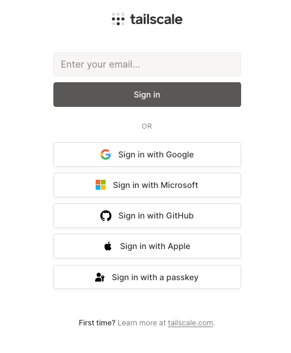

# Tailscale Setup

## Installation

Follow the official Tailscale download and installation instructions [here](https://tailscale.com/download)

## Login

When prompted to login, use your AWS **email**, i.e. the address ending in `@andywebservices.com`. Do **NOT** use 
`Sign in with a passkey`. Place your AWS email in the box with the hint `Enter your email...` and click `Sign in`. You 
will be redirected to the AWS Pocket ID instance and be prompted to authenticate.

## Troubleshooting

If any step fails, notify the AWS Administrator.
